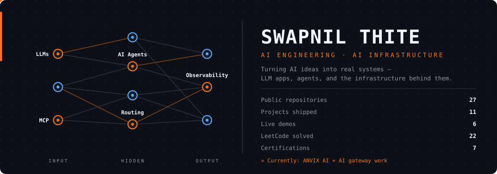

  

 

---

## `~/whoami`

I'm **Swapnil Thite**, a B.E. **Artificial Intelligence & Data Science** student (DY Patil Institute of Technology, Pune · 2029) building AI systems end-to-end — from LLM apps and agents to the infrastructure behind them.

- 🚀 Building **ANVIX AI** and **AI infrastructure** — gateway, model routing, observability
- 🤖 Working with **LLMs, AI agents, MCP, tool calling** and structured outputs
- 👨‍💻 Sharpening **DSA and software engineering fundamentals** — 22 LeetCode problems solved and climbing

---

## Tech Stack

  

`Python` · `C` · `HTML` · `CSS` · `JavaScript` · `TypeScript` · `React` · `Next.js` · `AI API Integration` · `OpenCV` · `MediaPipe`

🌱 Currently learning: `Java` · `DSA` · `OOP` · `SQL` · `Spring Boot` · `PostgreSQL`

---

## Connect With Me

- 💼 **LinkedIn** — [linkedin.com/in/swapnil-thite-108098385](https://www.linkedin.com/in/swapnil-thite-108098385/)
- 🧩 **LeetCode** — [leetcode.com/u/swapnil__1212_](https://leetcode.com/u/swapnil__1212_/) · 22 problems solved and climbing
- 💻 **GitHub** — [github.com/thiteswapnil1212-hue](https://github.com/thiteswapnil1212-hue)

---

## Projects

 <strong>ANVIX AI</strong> — multi-model AI coding IDE · <code>Next.js</code> <code>TypeScript</code>

 
Chat with many LLMs through one unified interface — workspaces, dashboard, generation tools, auth and PostgreSQL persistence.
  
<a href="https://anvix-ai.vercel.app/">Live Demo</a> · <a href="https://github.com/thiteswapnil1212-hue/ANVIX-AI">Repository</a>

 <strong>CuriousPARC 2026</strong> — adaptive emergency-response intelligence · <code>Next.js</code> <code>Gemini</code>

 
3 AI agents + orchestrator with human-in-the-loop approval and live replanning when the situation changes. Built for the CuriousPARC 2026 hackathon.
  
<a href="https://cupriouspark.vercel.app/">Live Demo</a> · <a href="https://github.com/thiteswapnil1212-hue/cupric2026">Repository</a>

 <strong>Nirman Drushti</strong> — explainable infrastructure-intelligence platform · <code>Next.js</code> <code>FastAPI</code>

 
Turns government project-monitoring data (PAIMANA/MoSPI) into transparent indicators, predictive risk and early warnings. Built for Smart India Hackathon.
  
<a href="https://frontend-pearl-delta-28.vercel.app/">Live Demo</a> · <a href="https://github.com/thiteswapnil1212-hue/nirman-drushti">Repository</a>

 <strong>VisionSwipe AI</strong> — hand-gesture control system · <code>Python</code> <code>MediaPipe</code>

 
MediaPipe + OpenCV with a state-machine architecture for touch-free interaction.
  
<a href="https://github.com/thiteswapnil1212-hue/visionswip">Repository</a>

 <strong>Mauli Interior</strong> — live business website · <code>Next.js</code> <code>Three.js</code>

 
Production site for a Pune furnishing studio — 3D room studio, products, projects showcase, SEO.
  
<a href="https://mauliinterior-stores-web.vercel.app/">Live Demo</a> · <a href="https://github.com/thiteswapnil1212-hue/INTERIOR-STORES-WEB">Repository</a>

 <strong>SkillGrid</strong> — student productivity platform · <code>Next.js</code> <code>Supabase</code>

 
Academics, DSA tracker, habits, focus time and leaderboards for students.
  
<a href="https://github.com/thiteswapnil1212-hue/skillGrid">Repository</a>

 <strong>English Learning App</strong> — English for young students · <code>JavaScript</code>

 
Learning app for ages 4–7 with a friendly mascot buddy. Vanilla HTML/CSS/JS.
  
<a href="https://english-learning-app-eight-zeta.vercel.app/">Live Demo</a> · <a href="https://github.com/thiteswapnil1212-hue/English-learning-app">Repository</a>

 <strong>Stocksense-AI</strong> — AI assistant for trading · <code>Next.js</code> <code>OpenAI</code>

 
Market data via yahoo-finance2, AI insights, interactive Recharts visualizations.
  
<a href="https://github.com/thiteswapnil1212-hue/Stocksense-AI">Repository</a>

 <strong>AI Agents Workshop</strong> — hands-on agent experiments · <code>Python</code> <code>MCP</code>

 
Tool-augmented reasoning with vLLM, Pydantic AI and Model Context Protocol.
  
<a href="https://github.com/thiteswapnil1212-hue/ai-agents-workshop">Repository</a>

 <strong>GesturePilot AI</strong> — control games with bare hands · <code>Python</code>

 
Gesture-based game controller — no controller needed.
  
<a href="https://github.com/thiteswapnil1212-hue/Hill-climb-racing-controller">Repository</a>

 <strong>AI Photo Enhancer</strong> — photo enhancement web app · <code>HTML</code> <code>CSS</code>

 
AI photo enhancement with detailed, natural lighting.
  
<a href="https://a-iphotoenhancer.vercel.app/">Live Demo</a> · <a href="https://github.com/thiteswapnil1212-hue/AIphotoenhancer-">Repository</a>

---

## GitHub Activity

<picture>
  <source media="(prefers-color-scheme: dark)" srcset="https://github-readme-stats.vercel.app/api?username=thiteswapnil1212-hue&show_icons=true&hide_border=true&bg_color=00000000&title_color=F97316&icon_color=F97316&text_color=E6EDF3">
  <source media="(prefers-color-scheme: light)" srcset="https://github-readme-stats.vercel.app/api?username=thiteswapnil1212-hue&show_icons=true&hide_border=true&bg_color=00000000&title_color=F97316&icon_color=F97316&text_color=24292F">
  
</picture>

<picture>
  <source media="(prefers-color-scheme: dark)" srcset="https://github-readme-stats.vercel.app/api/top-langs/?username=thiteswapnil1212-hue&layout=compact&hide_border=true&bg_color=00000000&title_color=F97316&text_color=E6EDF3">
  <source media="(prefers-color-scheme: light)" srcset="https://github-readme-stats.vercel.app/api/top-langs/?username=thiteswapnil1212-hue&layout=compact&hide_border=true&bg_color=00000000&title_color=F97316&text_color=24292F">
  
</picture>

---

## Certifications

| Issuer | Credential |
| --- | --- |
| **Anthropic** | AI Fluency: Framework & Foundations · Claude 101 (2026) |
| **Deloitte** | Technology Virtual Experience Program (2026) |
| **Goldman Sachs** | Credit Risk Virtual Experience Program (2026) |
| **JPMorgan Chase** | Quantitative Research Job Simulation (2026) |
| **HP LIFE** | Data Science & Analytics · AI for Beginners (2025) |

---

### Let's build something useful.

 

