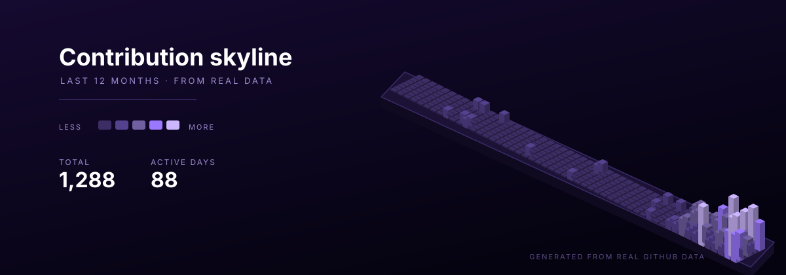

  

 

---

## About Me

  

### Experience

**Web Developer — Mauli Interior, Pune** *(family furnishing business)*
- Designed, built, and shipped the production website end-to-end — Next.js with a Three.js 3D room studio, products & projects showcases, full on-page SEO, WhatsApp enquiry deep-links
- A live business asset — real users, real visibility, not a tutorial project

### Recent Work

- **SkillGrid** — student productivity platform with 1,152 aptitude and 1,205 company-DSA questions, social features and a System Design practice section — [live demo](https://skill-grid-weld.vercel.app/) (repo private)
- **Team hackathon builds** — published my own public copies, full history preserved: [CodeQuest AI](https://github.com/thiteswapnil1212-hue/codequest-ai) (Vortexa), [SkillPath](https://github.com/thiteswapnil1212-hue/skillpath) (Devkraft PS2), [Skill-Sathi](https://github.com/thiteswapnil1212-hue/skill-sathi)

### Education

**DY Patil Institute of Technology, Pimpri, Pune** — B.E. AI & Data Science, 2025–2029

---

## Skills & Tools

  

`Python` · `C` · `HTML` · `CSS` · `JavaScript` · `TypeScript` · `React` · `Next.js` · `Supabase` · `AI API Integration` · `OpenCV` · `MediaPipe`

🌱 Currently learning: `Java` · `DSA` · `OOP` · `SQL` · `Spring Boot` · `PostgreSQL`

---

## Featured Projects

- **ANVIX AI** — Multi-model AI coding IDE with workspaces, auth & PostgreSQL. [Live](https://anvix-ai.vercel.app/) · [Repo](https://github.com/thiteswapnil1212-hue/ANVIX-AI)
- **SkillGrid** — Student productivity platform: aptitude + company-DSA banks, social features, System Design practice. [Live](https://skill-grid-weld.vercel.app/) · *repo private*
- **Mauli Interior** — Production furnishing-studio website with 3D room designer, live for a real business. [Live](https://mauliinterior-stores-web.vercel.app/) · [Repo](https://github.com/thiteswapnil1212-hue/INTERIOR-STORES-WEB)
- **CodeQuest AI** — Guided Python learning workspace: coding missions + AI mentor, local Pyodide execution. Team hackathon build (Vortexa), own public copy. [Repo](https://github.com/thiteswapnil1212-hue/codequest-ai)
- **SkillPath** — Adaptive learning & assessment portal with concept maps and knowledge tracing. Team hackathon build (Devkraft PS2), own public copy. [Repo](https://github.com/thiteswapnil1212-hue/skillpath)
- **Nirman Drushti** — Infrastructure intelligence on government data (Smart India Hackathon, internal round). [Repo](https://github.com/thiteswapnil1212-hue/nirman-drushti)
- **VisionSwipe AI** — Touch-free hand-gesture control via MediaPipe + OpenCV. [Repo](https://github.com/thiteswapnil1212-hue/visionswip)

More: [30 public repositories](https://github.com/thiteswapnil1212-hue?tab=repositories) — including Skill-Sathi, CuriousPARC 2026 and DSA projects.

---

## Contributions

  
  

---

## GitHub Activity

<picture>
  <source media="(prefers-color-scheme: dark)" srcset="./profile-3d-contrib/profile-night-rainbow.svg">
  <source media="(prefers-color-scheme: light)" srcset="./profile-3d-contrib/profile-season.svg">
  
</picture>

---

## Certifications

  

---

*Thanks for visiting — let's build something useful together.*

